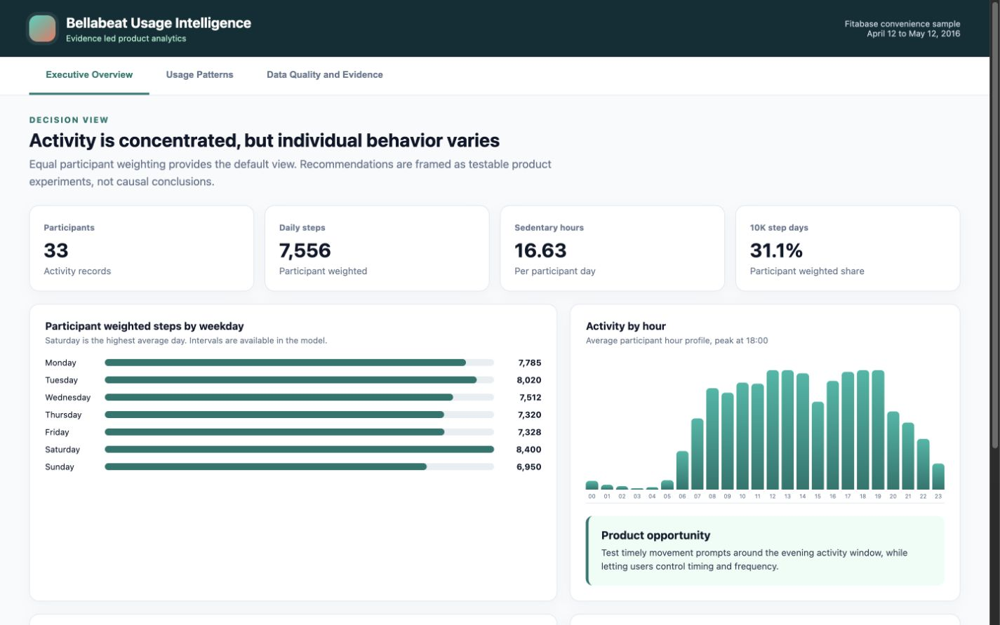
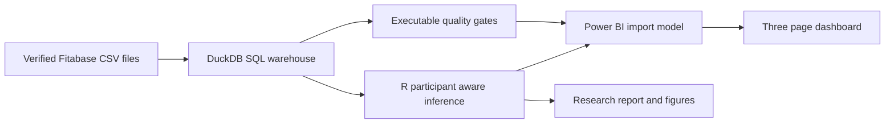

# Bellabeat Usage Intelligence

[](https://github.com/KazmirFahrier/bellabeat-case-study/actions/workflows/ci.yml)


An evidence led product analytics project that turns public wearable data into reproducible usage insights, visible quality controls, and testable product recommendations.



## Headline findings

| Finding | Decision value |
|---|---|
| Participant weighted daily steps are **7,556**, with a 95% interval from **6,413 to 8,718** | Establishes an honest sample baseline without letting frequent loggers dominate |
| Activity peaks on **Saturday** and near **18:00** | Identifies candidate timing windows for randomized prompt tests |
| The within participant sleep estimate is **inconclusive** because its interval includes zero | Prevents a misleading causal claim from the naive day level model |

The analysis describes a small historical convenience sample. It does not claim to represent Bellabeat customers or prove that product interventions will change behavior.

## Review the work

| Deliverable | Purpose |
|---|---|
| [Interactive dashboard prototype](powerbi/dashboard.html) | Three report pages for executive results, usage patterns, and evidence |
| [Power BI build package](powerbi/README.md) | Import tables, DAX measures, theme, Power Query pattern, and page specification |
| [Executive brief](docs/EXECUTIVE_BRIEF.pdf) | One page decision summary |
| [SQL analysis](sql/00_schema.sql) | Entry point for the DuckDB warehouse and conformed dimensions |
| [Full report](docs/REPORT.md) | Methods, findings, evidence grades, and experiment roadmap |
| [Data model](docs/DATA_MODEL.md) | Grain, keys, relationships, and analytical layers |
| [Data dictionary](docs/DATA_DICTIONARY.md) | Field definitions, types, null rules, and reporting outputs |
| [Data card](docs/DATA_CARD.md) | Provenance, scope, and responsible use |

## Analytical architecture



DuckDB owns ingestion, typing, duplicate handling, joins, business rules, quality checks, and reusable reporting views. R owns participant weighted inference, clustered uncertainty, sensitivity analysis, and figures. Power BI receives compact aggregate tables and documented measures.

## Why the statistical design matters

Daily records are repeated measurements, not independent people. The default estimates first summarize each participant, then average those profiles. Confidence intervals resample participants. The sleep analysis separately estimates naive day level, within participant, and between participant associations.

This design changes the conclusion. The naive model reports a precise negative activity and sleep association. After controlling for participant baselines and resampling participants, the interval crosses zero.

## Reproduce everything

Requirements are R 4.2 or newer, Python 3.11 or newer, and internet access for the first source download.

```bash
python3 -m venv .venv
.venv/bin/pip install -r requirements.txt
Rscript tests/test_pipeline.R
```

The workflow performs the following work:

1. Downloads a source pinned to an immutable Git commit.
2. Verifies the archive and selected CSV files with SHA 256 digests.
3. Builds the local DuckDB warehouse and enforces all SQL quality checks.
4. Runs descriptive analysis, participant inference, bootstrap intervals, and sensitivity checks in R.
5. Exports Power BI tables, rebuilds the dashboard prototype, and creates the executive brief.
6. Runs scientific assertions for source counts, estimates, uncertainty, and deliverables.

Raw source files and the local DuckDB database remain outside Git. Reviewable aggregate outputs are committed.

## Repository map

```text
sql/                              DuckDB schema, facts, checks, KPIs, and dashboard views
R/                                Analysis, inference, figures, and reporting exports
powerbi/data/                     Generated model ready aggregate tables
powerbi/measures.dax              Reusable report measures
powerbi/theme.json                Accessible report theme
powerbi/DASHBOARD_SPEC.md         Three page report specification
scripts/run_sql.py                Warehouse build and quality gate runner
scripts/build_dashboard.py        Portable dashboard prototype generator
scripts/generate_executive_brief.py  One page PDF generator
docs/                             Report, brief, data model, dictionary, and data card
tests/test_pipeline.R             Complete reproduction and scientific checks
.github/workflows/ci.yml          Automated Linux reproduction
```

## Power BI note

The repository provides a complete Power BI Desktop import package but does not claim that an untested `.pbix` binary was produced in this environment. Build instructions are in [powerbi/README.md](powerbi/README.md). The browser prototype uses the same generated data and mirrors the intended three page report.

## Scope

The verified analytical sample contains 936 valid daily records from 33 participants between April 12 and May 12, 2016. Sleep covers 24 participants, weight covers 8, and the primary within participant sleep analysis uses 18 participants with at least five matched days. Demographics, recruitment details, device adherence, and current customer behavior are unavailable.

## License

Project code and authored documentation are MIT licensed. External Fitabase data is not redistributed here and remains subject to its source terms.
