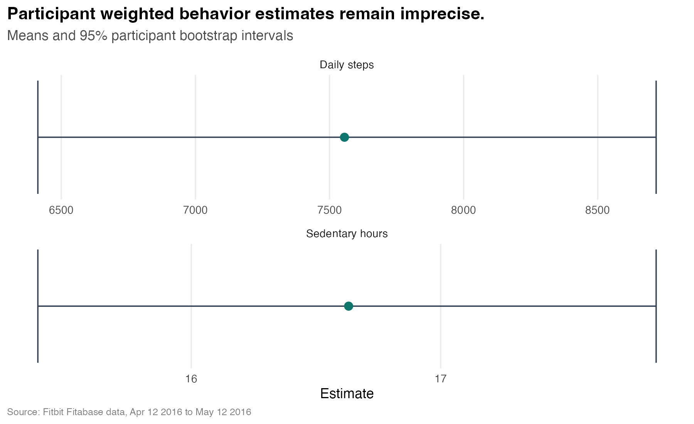

# Bellabeat Usage Study: Participant Aware Behavioral Analysis

This project asks a more careful question than the standard Bellabeat capstone:

> Which smart device usage patterns remain credible when participants, rather than repeated daily
> records, are treated as the unit of evidence?

The answer changes the story. Descriptive routines are visible, but the sample is too small for
precise population claims. A naive day level model suggests that higher step days are associated
with less sleep. After controlling for each participant's baseline and resampling participants,
that relationship is no longer distinguishable from zero.

## Key results

| Result | Estimate | 95% participant interval |
| --- | ---: | ---: |
| Participant weighted daily steps | 7,556 | 6,413 to 8,718 |
| Participant weighted sedentary hours | 16.63 | 15.38 to 17.86 |
| Participant weighted share of 10k step days | 31.1% | 21.1% to 42.0% |
| Within participant sleep change per 1,000 steps | minus 0.058 hours | minus 0.127 to 0.015 |

The sleep interval includes zero. This study therefore does not claim that more activity reduces
sleep. It shows why repeated days cannot be treated as hundreds of independent people.



## What makes this analysis different

1. The source archive is pinned to an immutable Git commit and verified with SHA 256 checks.
2. Daily and hourly summaries give each participant equal weight.
3. Uncertainty intervals resample participants instead of individual days.
4. The activity and sleep analysis separates day level, within participant, and between
   participant associations.
5. Observation weighted and participant weighted estimates are compared as a sensitivity test.
6. Recommendations are expressed as experiments with a primary metric and a guardrail.
7. CI runs the complete download, integrity, cleaning, analysis, visualization, and scientific
   validation workflow.

## Evidence, not causal claims

The data supports three directional observations:

1. Activity data covers 33 participants, while sleep covers 24 and weight covers only 8.
2. Participant weighted activity is highest around 6 PM and on Saturday, but intervals are wide.
3. Within participant evidence does not establish a reliable activity and sleep relationship.

These patterns motivate product experiments. They do not establish that a notification, feature,
or marketing message will change behavior.


## Reproduce the study

Requirements are R 4.2 or newer, internet access, and the packages declared in `DESCRIPTION`.

```r
install.packages(c("digest", "here", "janitor", "lubridate", "scales", "tidyverse"))
source("R/run_all.R")
```

Run the complete pipeline and its scientific assertions with:

```bash
Rscript tests/test_pipeline.R
```

The first run downloads about 25 MB, verifies the archive and selected CSV files, and keeps the
raw source data outside Git. Later runs verify the cached files before using them.

## Repository map

```text
R/00_utils.R                    Validation and participant bootstrap helpers
R/01_download_data.R            Pinned download, archive check, and file checks
R/02_clean_and_merge.R          Typed cleaning, key validation, and quality audit
R/03_analyze.R                  Descriptive summaries
R/04_inference.R                Participant inference and sensitivity analysis
R/04_visualize.R                Seven report figures
R/run_all.R                     Complete pipeline entry point
data/RAW_DATA_MANIFEST.csv      Immutable source and SHA 256 provenance
data/processed/                 Generated reviewable result tables
docs/REPORT.md                  Full case study
docs/DATA_CARD.md               Data provenance, scope, and responsible use
tests/test_pipeline.R           End to end scientific assertions
.github/workflows/ci.yml        Reproduction on GitHub Actions
```

## Scope and limitations

The dataset contains 936 daily records from 33 device users over April 12 through May 12, 2016.
Only 18 participants have at least five matched sleep days for the primary within participant
analysis. Demographics, recruitment details, device adherence, and Bellabeat customer behavior are
not available. Results are exploratory, historical, and not representative of current customers.

The full reasoning, evidence grades, and experiment roadmap are in
[`docs/REPORT.md`](docs/REPORT.md). Source details are in
[`docs/DATA_CARD.md`](docs/DATA_CARD.md).

## License

Project code and authored documentation are MIT licensed. The external Fitabase data is not
redistributed here and remains subject to its source terms.
