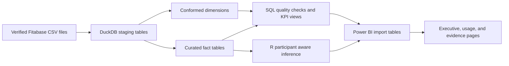

# Analytical data model

The project uses a layered model. DuckDB performs source ingestion, typing, duplicate handling, joins, quality gates, and reusable aggregations. R consumes curated facts for participant aware inference and confidence intervals. Power BI receives compact aggregate tables for reporting.

## Core model

| Table | Grain | Primary key | Purpose |
|---|---|---|---|
| `dim_participant` | One row per participant | `participant_id` | Conformed anonymous participant identifier |
| `dim_date` | One row per calendar date | `calendar_date` | Weekday and weekend attributes |
| `dim_hour` | One row per hour | `hour_of_day` | Daypart classification |
| `fact_daily_activity` | One participant and activity date | `participant_id`, `activity_date` | Daily activity, sedentary time, and step goal status |
| `fact_daily_sleep` | One participant and sleep date | `participant_id`, `sleep_date` | Consolidated sleep duration and time in bed |
| `fact_weight` | One participant and weight date | `participant_id`, `weight_date` | Sparse weight and BMI observations |
| `fact_hourly_activity` | One participant and timestamp | `participant_id`, `activity_hour` | Joined steps, intensity, and calories |
| `participant_kpis` | One participant | `participant_id` | Equal weight participant metrics and engagement segment |

## Relationships

`dim_participant` has one to many relationships to every fact table. `dim_date` connects to the date column in each daily fact. `dim_hour` connects to `fact_hourly_activity.hour_of_day`. All joins are many to one from facts to dimensions with single direction filtering.

The Power BI files are reporting tables rather than another source of truth. Their values are generated from the SQL and R layers on every pipeline run.

## Estimands

The default executive estimand gives each participant equal weight. This prevents participants with more logged days from dominating the result. Observation weighted alternatives remain available in `sensitivity.csv` for comparison.

The sleep analysis separates the naive day level association, the within participant association, and the between participant association. This distinction prevents repeated observations from being treated as independent evidence.
