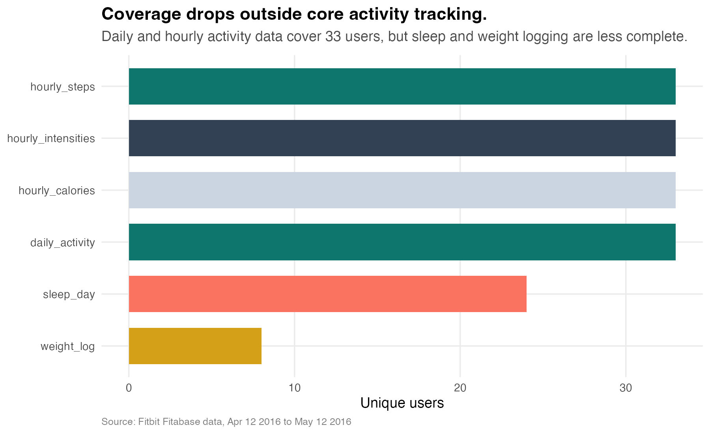
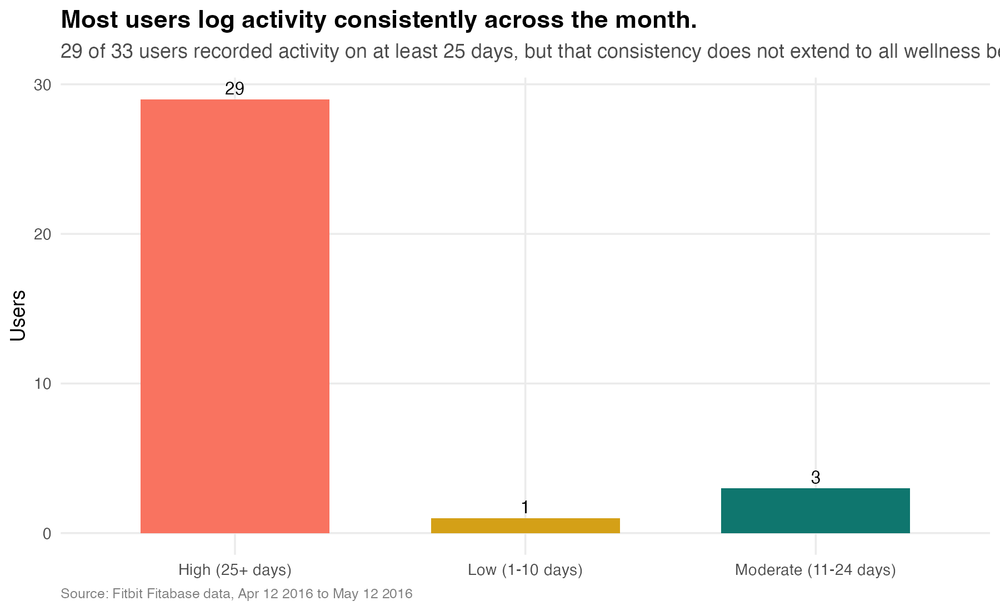
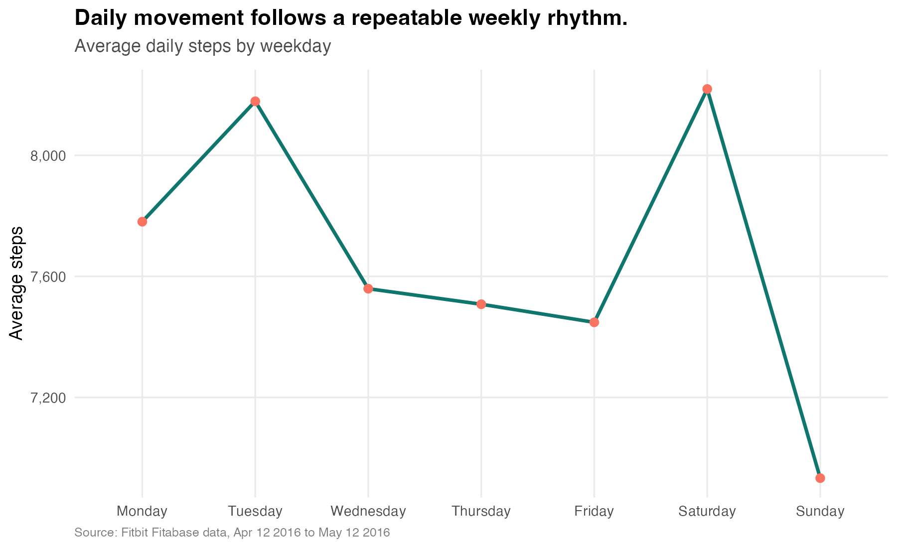
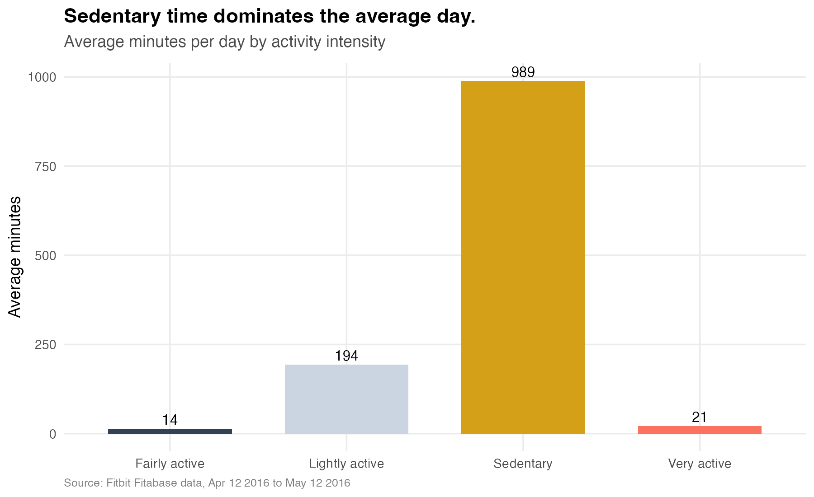
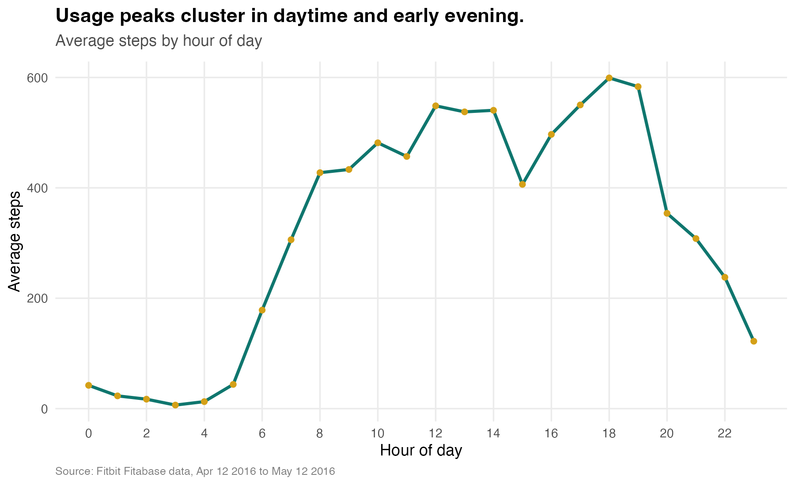
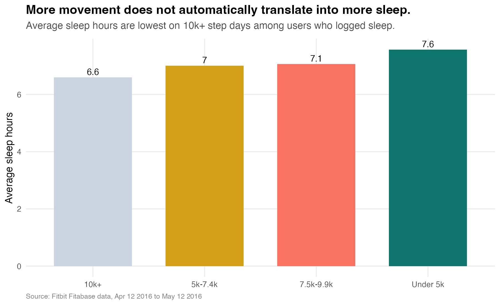

# Bellabeat Smart Device Usage Analysis

**Author:** Kazmir Fahrier
**Role:** Junior Data Analyst, Bellabeat Marketing Analytics Team
**Date:** April 2026
**Tools:** R · tidyverse · ggplot2

---

## 1. Business Task

Bellabeat wants to understand how consumers use non-Bellabeat smart devices so
the company can translate those patterns into better product positioning and
marketing strategy for one Bellabeat product line.

This report answers three questions:

1. What are some trends in smart device usage?
2. How could these trends apply to Bellabeat customers?
3. How could these trends help influence Bellabeat marketing strategy?

The analysis focuses on Bellabeat's **Time** watch and connected app
experience, since the available Fitbit dataset is strongest for activity, sleep,
and hourly behavior patterns.

---

## 2. Data Sources

| Item | Detail |
|------|--------|
| Primary dataset | Fitbit / Fitabase usage data |
| Time window | April 12, 2016 to May 12, 2016 |
| Delivery format | Original Fitabase ZIP archive |
| Activity users | 33 users |
| Sleep users | 24 users |
| Weight users | 8 users |
| License | CC0 Public Domain via Kaggle / Mobius |

### Credibility and limitations

- **Reliable enough for exploration:** device-generated behavioral data is
  useful for directional trend analysis.
- **Limited sample:** the dataset is small and not representative of all smart
  device users.
- **Outdated:** the data is from 2016, so any recommendation should be framed as
  directional rather than market-definitive.
- **Partial coverage:** sleep and weight logging cover fewer users than daily
  activity, which affects what Bellabeat can infer about holistic wellness
  habits.

---

## 3. Data Preparation

The pipeline uses six files from the Fitabase archive:

- `dailyActivity_merged.csv`
- `sleepDay_merged.csv`
- `hourlySteps_merged.csv`
- `hourlyIntensities_merged.csv`
- `hourlyCalories_merged.csv`
- `weightLogInfo_merged.csv`

Cleaning and preparation steps:

1. Download the original ZIP archive from a public mirror.
2. Extract only the files relevant to Bellabeat's business question.
3. Standardize column names with `janitor::clean_names()`.
4. Parse daily and hourly timestamps with `lubridate`.
5. Remove exact duplicate rows.
6. Aggregate sleep and weight records to one row per user per date.
7. Merge sleep and weight coverage into the daily activity table.
8. Engineer analysis fields such as:
   - `day_of_week`
   - `week_part`
   - `sleep_hours`
   - `step_goal_achieved`
   - `step_bucket`
   - `engagement_segment`

Generated chart PNGs and summary CSVs are produced by the pipeline. The cleaned
RDS intermediates are regenerated locally and kept out of Git because of size.

---

## 4. Analysis & Findings

### Finding 1 — Activity logging is strong, but holistic wellness logging is not

The Fitbit dataset shows a sharp drop in coverage once behavior moves beyond
core activity tracking:

- **33 users** appear in daily activity and hourly activity files
- only **24 users** appear in sleep logs
- only **8 users** appear in weight logs

At the same time, **29 of 33 users** log activity on at least 25 of the 31 days
in the dataset. That suggests consumers are willing to wear and sync a device
consistently, but not all wellness behaviors are captured with the same
regularity. For Bellabeat, that is a strong signal that passive, low-friction
tracking matters more than asking users to manually build a full wellness log.

### Finding 2 — Users are moderately active, but still spend most of the day sedentary

The average day in the dataset looks like this:

- about **7,671 steps**
- about **2,313 calories**
- about **228 active minutes**
- about **16.5 sedentary hours**
- only **32.4% of days** meet the 10,000-step threshold

The minute mix is even more revealing: users average about **989 sedentary
minutes**, versus **194 lightly active minutes**, **14 fairly active minutes**,
and **21 very active minutes**. The opportunity is not to market Bellabeat as
an athlete product. It is to position Bellabeat as a consistency and lifestyle
coach for people who are active in short windows but still spend most of the
day inactive.

### Finding 3 — Smart-device usage follows routine-based daily rhythms

Hourly activity peaks are concentrated in daytime and early evening, with the
strongest step volume around **12 PM** and **5 PM to 7 PM**. That pattern points
to routine-based movement: lunch breaks, errands, and after-work activity
windows rather than all-day high performance behavior.

By weekday, average step volume is strongest on **Saturday** and **Tuesday** and
lowest on **Sunday**. Bellabeat can use these routine windows to time nudges,
content, and campaign messaging when users are already most receptive.

### Finding 4 — More movement does not guarantee better sleep

Among days where users logged sleep, the longest sleep appears on the
lowest-step days, while **10k+ step days average the shortest sleep** in this
sample. That does not mean activity is bad for sleep. It means the relationship
is not automatically positive, and users may need help balancing movement,
recovery, and routines together.

For Bellabeat, this supports a broader wellness message: activity alone is not
enough. The Bellabeat app and Time watch should frame progress through a
combined movement-and-recovery lens.

---

## 5. Summary

| Dimension | Bellabeat-relevant insight |
|-----------|----------------------------|
| Core behavior | Activity logging is consistent for most users |
| Coverage gap | Sleep and weight logging drop off sharply |
| Daily movement | Average user logs ~7.7k steps per day |
| Sedentary pattern | Average day still includes ~16.5 sedentary hours |
| Goal attainment | Only 32.4% of days reach 10k steps |
| Routine window | Activity peaks around lunch and early evening |
| Sleep relationship | Higher-step days do not automatically mean more sleep |

The Bellabeat opportunity is not simply to sell another tracker. It is to turn
routine activity data into a fuller wellness coaching experience that helps
users connect movement, recovery, and consistency.

---

## 6. Top Three Recommendations

### 1. Position Bellabeat Time as a consistency coach, not a performance device

The data reflects routine users, not extreme athletes. Bellabeat Time should be
marketed around sustainable daily progress, habit-building, and lifestyle
balance instead of peak-performance framing.

### 2. Build campaigns around low-friction wellness tracking

Since activity coverage is strong but sleep and weight coverage are much weaker,
Bellabeat should emphasize passive tracking and simple daily summaries. Marketing
should highlight "automatic insight" rather than manual logging effort.

### 3. Trigger app messages during the windows when people already move

The strongest usage windows are midday and early evening. Bellabeat should test
timed nudges, movement reminders, and recovery prompts around those natural
behavior peaks, especially for Time users who are already wearing a watch
throughout the day.

---

## 7. Next Steps

- Validate these directional findings against newer first-party Bellabeat app
  data.
- Compare device usage patterns by acquisition channel and lifecycle stage.
- Test whether habit-building messaging or performance messaging produces
  stronger conversion for Bellabeat Time.
- Add newer sleep-quality, stress, or mindfulness data so Bellabeat can measure
  full-wellness behaviors rather than activity alone.
